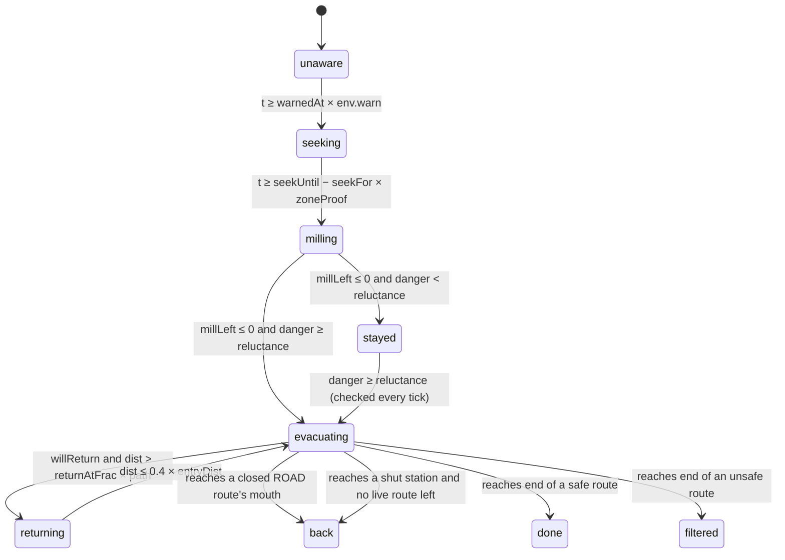

# How the agents decide — the full logic, and what you are looking at

This note covers how the household agents make decisions, read from the code
(`src/population.js`, `src/engine.js`, `src/conditions.js`, `src/map.js`,
`src/app.js`, `tools/fetch_city.py`) as of this commit. It does four things:

1. Defines **every decision** an agent makes, with the rule that makes it,
   including the full logic of **re-routing around corridor closures**.
2. Explains **what each dot, ring and circle on screen** represents.
3. Lists **gaps and enhancement suggestions**, including whether a JEV-style
   typed decision model could reasonably replace some of the hand-written
   rules.
4. Lists **open questions** for further research and documentation.

Line references are to `src/engine.js` unless stated. Where this note
disagrees with `docs/METHOD.md`, the code wins and the disagreement is listed in
§8.

---

## 1. What "offline" means here

No decision in this model is made by a language model, a server or any network
call. All of them are **deterministic, rule-based functions that run in the
browser**, seeded so that a run reproduces exactly from its URL. The upstream
Race Condition project wires its runners to LLM agents. This repo kept only the
movement loop (N agents on shared polylines) and replaced the agents' "minds"
with closed-form rules.

Decisions are made in three places, at three different times:

| When | Where | What is decided | Changes during a run? |
|---|---|---|---|
| **Build time** (once per city pack) | `tools/fetch_city.py` | Which points are exits (`EXITS`, `TRANSIT_EXITS`, hand-chosen). The route to each exit is a Dijkstra shortest path over the OSM road graph from the population-weighted centroid. Each zone's **approach leg** to each route is the road path to the route vertex nearest that zone. Each transit exit's **transfer legs** go to every other route. Which buildings people start in. | No. These are files in `data/cities/<city>/`. |
| **Population build** (every rebuild, seeded) | `buildPopulation`, `buildEntries`, `createSim` | Each household's cohort, travel unit, behaviour, speed, information quality `info`, risk tolerance `risk`, warning time, how long it seeks and mills, reluctance threshold, start building, lane offset, a personal **taste** (bias) for every route, **whether it will turn back** (`willReturn`), and how far out it does so. | No. Fixed for the run, and restored on reset. |
| **Run time** (every tick) | `createSim().tick` | State transitions, which route to take, whether to re-route, what to do at a closed road or a shut station door. | Yes. These rules read live, shared state: queues, density, zone social proof, route open/closed, weather. |

So an agent has no memory, no beliefs that update, no communication and no
plan. It has **fixed traits**, and on each tick it applies **fixed rules** to
those traits plus a few **shared aggregates** (§5). The METHOD calls this
"mean-field coupling with local neighbourhoods", and that label is accurate.

---

## 2. The decision unit

One agent is one **travel unit**: a person alone, a family, an ad-hoc group or
an institution. The family is the case the question asks about. A family does
not split, does not wait for a particular member and does not reunite. Its
"waiting for the family" is a longer milling timer (`millingScale` 1.9), and
its "moving at the pace of the slowest" is a speed multiplier (`pace` 0.80).

| Trait | How it is drawn (`population.js`) | What it drives |
|---|---|---|
| `cohort` | Zone's published split (or mix override) | Base speed; per-cohort weather penalties |
| `unit` | Mix shares (28/44/20/8). A child is forced into `family`; an adult drawn into `institutional` becomes `family` 60% of the time | Pace multiplier, milling scale, group size, herd pull (`group` ×1.5) |
| `behaviour` | Mix shares (24/30/26/13/7) | `seek`, `mill`, `reluctance`, `returns` |
| `info` ∈ [0,1] | N(infoQuality, 0.18·spread) | When the warning arrives, how fast the warning is confirmed, how much of a queue the agent sees, whether it knows a route is closed, and whether it may re-route |
| `risk` ∈ [0,1] | N(0.5, 0.2·spread) | Lowers the reluctance threshold; lowers the in-district hazard slowdown |
| `speed` m/s | N(cohort base, 0.12·spread) × unit pace, floor 0.25 | Every travel-time estimate and all movement |
| `warnedAt` s | zone lag U[0, 0.7·spread] + N(spread·(1−info)·0.55, spread·0.15·timing) | When `unaware` ends |
| `seekFor` s | N(seek·900, seek·260·timing) | Length of `seeking` |
| `millFor` s | N(mill·900·millingScale, mill·300·timing) | Length of `milling` |
| `reluctance` | behaviour.reluctance × (1 − 0.4·risk) | Danger threshold for leaving at all |
| `returnChance` → `willReturn` | Bernoulli(behaviour.returns), drawn once in `createSim` | Whether it turns back once |
| `returnAtFrac` | U[0.2, 0.65] | Fraction of the path at which it turns back |
| `entries[route].bias` | exp((U − 0.5)·0.9), so roughly 0.64–1.57 | Personal taste for each route |
| `lane` | N(0, 8 m) | Rendering only: sideways offset in the column |

---

## 3. The lifecycle — every transition rule



Here `danger = min(1, hazardSlider + env.hazard)`.

| From → to | Exact rule | Notes |
|---|---|---|
| `unaware → seeking` | `t ≥ warnedAt · env.warn` (l. 443) | Night multiplies `warn` by 2.1, so the warning arrives later. On entry, `seekUntil = t + seekFor / (0.35 + info)`. |
| `seeking → milling` | `t ≥ seekUntil − seekFor · zoneProof[zone]` (l. 452) | Confirmation lasts `seekFor/(0.35+info)`: about 2.9 × `seekFor` at `info = 0`, and 0.74 × at `info = 1`. A zone that is visibly moving shortens it. |
| `milling → …` | `millLeft −= dt / env.gather · (1 + 2.5 · zoneProof)` (l. 464) | When `millLeft ≤ 0`, the household compares danger with its reluctance. |
| `… → evacuating` | `danger ≥ reluctance` | Route chosen by `chooseRoute` at this moment (§4.1). |
| `… → stayed` | `danger < reluctance` | At the default hazard of 0.35, effectively every *reluctant* household stays, because its threshold is 0.43–0.72. That is why "stayed" ≈ 13–14% at the end of every default run. |
| `stayed → evacuating` | Re-checked **every tick** (l. 484) | Only the hazard slider or worse weather can trigger it. Time, social proof and information have no effect. |
| `evacuating → returning` | `willReturn && returnedAt === null && dist > path.length · returnAtFrac` (l. 511) | Decided at construction, so this is a probability, not a reaction to anything. |
| `returning → evacuating` | Walks back at 1.15× pace until `dist ≤ 0.4 · entryDist` (l. 551) | Then sets `willReturn = false` and continues on the **same route**. It does not choose a route again. |
| `evacuating → done / filtered` | `dist ≥ path.length` on a non-transit route, or on a live transit route | `filtered` if `route.safe === false` (Mariupol's eastward route). |
| `evacuating → back` | See §4.3 | **Terminal.** |

`done`, `filtered` and `back` are terminal. Nobody in `back` ever tries again.

---

## 4. Route choice, re-routing and corridor closure — the full logic

### 4.1 The cost an agent believes a route has (`routeCost`, l. 169)

```
seen     = info × env.visibility
travel   = (approachWalk + remainingRouteLength) / speed
expected = max(0, taken − outPeople) / (capacity/60) × seen
follow   = herd × (1 − seen) × (unit == group ? 1.5 : 1) × (taken / Σtaken) × travel
cost     = (travel + expected) × bias − follow
```

- **Distance** is exact (road approach leg + remainder of the route).
- **Queue** is the people committed to the route and not yet out, divided by
  its throughput, and **seen only in proportion to `seen`**. An agent with
  `seen = 0` thinks every route is empty.
- **Taste** (`bias`) scales the whole estimate, so a person who mildly prefers
  a bridge tolerates a proportionally longer queue on it.
- **Herding** subtracts time in proportion to the route's share of everyone
  who has chosen any route. It is strongest in the badly informed and in ad-hoc
  groups.
- `routeCost` itself **knows nothing about whether a route is open.** Closure
  enters only through the filters in `chooseRoute`.

### 4.2 Choosing (`chooseRoute`, l. 190)

The agent takes the minimum-cost route among those it **believes** are usable:

| Route condition | Excluded from choice when |
|---|---|
| Transit exit **suspended** (weather or shutdown clock) | `seen > 0.4`. "A closed gate is on the news." |
| Any route **not live** (user-closed, or suspended transit) | `seen > 0.7`. "Only the informed know." |
| Otherwise | Never excluded |

If every route is excluded, it falls back to `routes[0]`.

This runs once, at the moment the household starts evacuating, from
`milling` or `stayed`.

### 4.3 Reconsidering (`reconsider`, l. 256)

It runs only if the **Re-route** option is on (default true). For each agent
in `evacuating`, on every tick:

1. **Already on the route** (`dist ≥ entryDist`): stop. Once you have joined
   the corridor, you are committed.
2. **Not yet time** (`t < nextThink`): stop. Thinking is staggered at random
   within each 300 s, then happens every 300 simulated seconds
   (`RECONSIDER_EVERY`).
3. **Cannot see** (`seen < 0.35`): stop. "Someone who cannot judge a queue
   cannot be re-routed by one."
4. `best = chooseRoute(...)`, which applies the same closure filters as §4.2.
5. Switch only if `cost(current) > cost(best) × 1.08` (`SWITCH_MARGIN`). On a
   switch, a new path is built from **where the agent is standing**, then
   `reroutes++`.

Note that when an agent switches, the new path is
`[here, ...zoneApproachLeg, ...routeRemainder]`. The approach leg starts at the
zone's road node, so the first segment is a **straight line** from the current
position back to that node. It is usually short. It is not a road path.

### 4.4 Corridor closure, end to end

A closure can come from three sources. All three set `route.live = false`:

| Source | Applies to | Set by |
|---|---|---|
| User clicks a route in **Routes — click to close one** | Any route | `r.open = false` (`app.js`) |
| **Weather** suspends a mode (`env.transit[mode] < 0.05`) | Transit exits only | Every tick (l. 377) |
| **Shutdown clock** (`t ≥ transitShutdown h`) | Transit exits only | Every tick (l. 378) |

What happens to a household depends on its effective information `seen`:

| `seen` | At departure | While in district (every 5 min) | At the end |
|---|---|---|---|
| **> 0.7** | Will not choose a closed route | Could switch, because `chooseRoute` excludes the closed route. **But** the switch still has to pass `cost(current) > 1.08 × cost(best)`, and `cost(current)` ignores the closure. If the closed route was its cheapest option, it usually **stays on it** | Road: reaches the mouth → `back` (terminal). Transit: reaches the door → `transfer` |
| **0.4 – 0.7** | Will not choose a *suspended transit* route. **Can choose a user-closed road** | Reconsiders, but the closed route is not filtered and its cost has no penalty, so the closure has no effect on its choice | As above |
| **0.35 – 0.4** | Can choose any closed route | Reconsiders on queue and herd only. Closure has no effect | As above |
| **< 0.35** | Can choose any closed route | Never reconsiders | As above |

**At a closed road's mouth** (l. 503–508): if the agent crosses `entryDist`
onto a route that is not live and not transit, its state becomes `back`, it
gets `turnedBack = true`, it is no longer drawn, and **it never tries another
route**. The console counts it under the lifecycle row "Turned back — route
closed". METHOD.md §2 says only agents with `info < 0.7` turn back. In the code,
everyone who reaches the mouth turns back, whatever their information.

**At a shut station's door** (`transfer`, l. 581): the household knows it is
shut now, whatever its `info`. It picks the cheapest **live** route using a
plain cost: `(transferLegWalk + remaining) / speed + fullQueue`. That cost has
no information discount, no taste and no herding. The household walks the
precomputed transfer leg (by road) and joins that route like any other
arrival. `turnedAway++` and `reroutes++` are recorded. Only if no route at all
is live does it become `back`.

**Side effects:**
- A household that reaches `back` **never releases its `taken`** on the
  closed route. The closed route's apparent popularity therefore stays high,
  and through the herding term it keeps pulling badly informed households
  towards it.
- Reopening a route mid-run has no effect on anyone already in `back`.

**Measured** (seed 20220316, 4,000 households, the engine's neutral default
environment, default sliders, shortest road route closed, 2,600 ticks of 30 s.
This can be reproduced with a short script that drives `createSim` the way
`test/model.test.mjs` does):

| City, closed route | Closed at | People who turned back (terminal) | Of whom `info > 0.7` |
|---|---|---|---|
| Mariupol, South-west · coastal road | T+0 | 8,674 (23% of exposed) | 0 |
| Mariupol, same | T+60 min | 9,790 | 608 |
| Lower Manhattan, Manhattan Bridge | T+0 | 11,178 (≈14%) | 0 |

So a closure **at T+0** is avoided only by the best-informed agents (above
0.7). Everyone else who picks the closed road walks to it and leaves the
simulation. A closure **mid-run** also catches well-informed households that
had already committed in their heads. The 1.08 margin, applied to a cost that
ignores the closure, stops them switching. In Mariupol, re-routing for **any**
reason was 0.0% across these runs. In the US cities it was 0.9–2.5% in clear
weather and 0.0% in fog.

---

## 5. What agents react to — the shared aggregates

All are in **people** (sums of `weight`) and recomputed every tick:

| Aggregate | Definition | Read by |
|---|---|---|
| `zoneProof[z]` | 0.75 × (zone's people moving / zone people) + 0.25 × city-wide share moving | Seeking, milling |
| `route.queued` | People within 300 m before the route mouth | Pace in the queue band |
| `route.onRoute` → `density` → `flowFactor` | Greenshields: `max(0.08, 1 − density / (2 × capacityDensity))` | Pace on the route |
| `route.taken`, `route.outPeople` | Committed and arrived | Expected queue, herding |
| `route.live` | Open and not suspended | Choice filters, mouth check, door check |
| `env.*` | Weather × time of day (`conditions.js`) | Warning, gather, pace, capacity, hazard, `visibility` (which scales `seen` everywhere) |

**Pace** (`paceOf`, l. 624) is physics, not decision-making. It is listed here
because it drives the queues that decisions react to:
- In the district: `speed × env.speed × perCohort × (1 − danger·(1−0.4·risk)·0.6)`.
  Within 300 m of the mouth, this is further multiplied by
  `(1 − 0.85·min(1, queued/capacity))`.
- On the route: `speed × env.speed × perCohort × 0.92 × flowFactor`.
- Floor: `CRAWL = 0.03 m/s`. Agents below it are counted as "reduced to a
  shuffle".

---

## 6. What each thing on screen represents

There are **no speech or thought bubbles** in this app. Agents do not
"say" anything. Every round marker is a deck.gl `ScatterplotLayer` (`map.js`).

| On screen | Layer id | Represents | Size | Colour / fill |
|---|---|---|---|---|
| **Small filled dots moving along roads** | `agents` | **One household (travel unit) that is currently `evacuating` or `returning`.** | `12 + √group × 7` m, clamped to 1.6–6 px, where `group` is the sampled number of members. (The headcount it stands for is `weight`, which is larger. See §8) | Depends on the **Classification** tab, below |
| Large translucent rings with labels | `zones` | An origin zone (district), at its published radius | `radius` property | Fixed cyan |
| Rings at route ends | `route-exits` | The far end of each route (an exit or a station door). Hollow and grey when not live | 130 m road / 90 m transit | Route colour, or grey when closed or suspended |
| Small dots with a white or black edge | `transit` | Every station or landing in the pack (66 in NYC). Most are **not** exits | Fixed | Blue subway, purple rail, teal ferry |
| Small yellow-to-red dots (Mariupol) | `damage` | UNOSAT damage points. **Display only. They do not affect movement** (BACKLOG P1-6) | By severity | Yellow → red |
| Text pills | `labels` | Route name (with "· closed / suspended / shut down") and zone name | — | — |
| Fading lines | `trails` | Recent path of ~120 sampled households | — | Their route's colour |

**Households you cannot see.** `positions()` skips any agent with no route
or that is `done`, `filtered` or `back`. Every household that is `unaware`,
`seeking`, `milling` or **`stayed`** is invisible, and so is every household
that turned back. The map shows only people who are moving. The waiting
population, which is usually the most important finding, appears only in the
**Lifecycle** bars.

**Dot colour by Classification tab:**

| Tab | Colour means |
|---|---|
| **Each one** (default) | Hue = behaviour (prompt green, seeker blue, wait-and-see amber, reluctant red, returner pink), shifted by cohort. Saturation = `info` (washed out means badly informed). Lightness = `speed` (dark means slow) |
| **Who** | Cohort: adult blue, child yellow, elderly pink, disabled red |
| **With** | Unit: alone grey, family yellow, group blue, institutional purple |
| **How** | Behaviour palette |
| **Route** | The route the household is currently on. A dot that **changes colour** has just re-routed or transferred |

**Lifecycle bars** (right panel) map 1:1 to the states in §3 (`STATE_LABEL`):
*Not yet warned* = `unaware`, *Confirming the warning* = `seeking`,
*Waiting — for family, for others* = `milling`, *Refusing to leave* = `stayed`,
*On a route* = `evacuating`, *Gone back for someone* = `returning`,
*Reached safety* = `done`, *Left the city, not to safety* = `filtered`,
*Turned back — route closed* = `back`.

**Route list counts** show people committed (`taken`). The count turns amber
when `flowFactor < 0.9` and red when `flowFactor < 0.6`.

---

## 7. Parameter quick reference (decision-relevant constants)

| Constant | Value | Role |
|---|---|---|
| `RECONSIDER_EVERY` | 300 s | Re-route cadence |
| `SWITCH_MARGIN` | 1.08 | Hysteresis on switching |
| re-route eligibility | `seen ≥ 0.35` | Who may reconsider |
| closed-route knowledge | `seen > 0.7` | Who avoids a closed route |
| suspended-transit knowledge | `seen > 0.4` | Who avoids a shut station |
| `LOCAL_WEIGHT` | 0.75 | Local vs city social proof |
| milling acceleration | `1 + 2.5·zoneProof` | How fast neighbours empty you out |
| seek denominator | `0.35 + info` | How information speeds confirmation |
| herd group pull | 1.5 | Ad-hoc groups follow the crowd harder |
| taste spread | `exp((U−0.5)·0.9)` | Route preference heterogeneity |
| queue band | 300 m | Where "queued" is counted |
| return fraction | U[0.2, 0.65] | Where a returner turns |
| return stop | 0.4 × entryDist | How far back a returner goes |
| `DEFAULTS.hazard`, `herd` | 0.35, 0.35 | Slider defaults |
| `transitShutdown` | 8 h | Operator clock (Sandy precedent) |

---

## 8. Where the docs and the code disagree

| Claim | Where | What the code does |
|---|---|---|
| "If the corridor is closed, an agent reaching the mouth with information quality below 0.7 turns back" | METHOD.md §2 | **Every** agent that reaches a closed road's mouth turns back. The 0.7 threshold only filters *choice* |
| Departure = `spread × (1−info) × (1−0.5·risk) × (1−0.4·damage)` | METHOD.md §2 | No damage or risk term. See `warnedAt` in §2 above, then seeking and milling |
| "~42% of non-child agents travel in a unit of 2–4, and a unit moves at 0.82× the fastest member" | METHOD.md §2 | Units and paces come from `TRAVEL_UNITS` (family 2–5 at 0.80, group 3–10 at 0.86, etc.) |
| "Size is headcount" | README / console legend | Size uses `group`, not `weight` (already in BACKLOG P3) |
| `getFillColor` dims `done` agents | `map.js` | Dead code: `positions()` never emits a `done` agent |

---

## 9. Enhancement examples and suggestions

### 9.1 Closure and re-routing (direct follow-ups to §4.4)

1. **Make closure part of the cost, not only a filter.** If the agent knows a
   route is closed, its cost should be ∞ in `routeCost`. Then the 1.08 margin
   cannot veto a switch away from a road the agent knows is shut.
2. **Let `back` be a decision, not an ending.** At a closed mouth, call the
   same logic as `transfer()`. Precompute "mouth → other route" legs as is
   already done for station doors. Keep `back` for "no live route" or for an
   explicit give-up probability. Release `taken` on the closed route either
   way.
3. **Learning at the mouth.** Arriving at a closed road should set the
   agent's knowledge of that route to certain, whatever its `info`. This is
   already true at a station door.
4. **Information diffusion about closures.** A per-zone "closure known"
   level that rises with time since closure and with the number of people
   turned back from that zone. This makes a closure a piece of news that
   spreads, not just a trait each agent has or lacks.
5. **Re-routing on the route itself** at specific decision points (junctions
   or bottlenecks), not only before the mouth. This is related to BACKLOG
   P2b's point bottleneck.
6. **Separate the four uses of `seen`** (queue legibility, closure knowledge,
   transit-status knowledge, re-route eligibility), as BACKLOG P1-8 already
   asks. The 0.35, 0.4 and 0.7 thresholds become named, sweepable parameters.

### 9.2 Behaviour and household realism

7. **Family reunification as an event.** Today it is a longer timer. Option:
   scatter family members at T0 (daytime: work, school), have them converge,
   and start the family's evacuation when the last arrives. That gives an
   actual "waiting for a son" mechanism, and the `gather` multiplier becomes
   emergent.
8. **Returners with a reason and a target.** Return to the origin, or to
   another household, rather than to 0.4 × entryDist. Base the decision on
   whether a family member is still inside.
9. **`stayed` that responds to more than the slider.** Allow social proof,
   official orders, or the number of neighbours already gone to lower
   reluctance over time. Today a reluctant household at hazard 0.35 never
   moves.
10. **Institutional transport as a resource.** A care home waits for buses
    that arrive at a modelled rate, instead of a long milling timer.
11. **Show the invisible.** Draw waiting households as faint static dots at
    their home buildings, coloured by state. The "still inside" population
    then becomes visible on the map. Optionally pulse a dot on re-route or
    turn-back, so those decisions can be seen.
12. **Per-agent inspector.** Click a dot to show its traits, state, current
    route, cost of every route as it sees them, and last decision. This is
    the single most useful tool for explaining offline decisions to a
    viewer.

### 9.3 Validation

13. Add tests for the closure path. For example: "a household with `seen > 0.7`
    on a closed road switches when an alternative is live", and "closing a
    route at T+0 does not turn back more than X%".
14. Run multiple seeds, and do the sensitivity sweep (BACKLOG P0-2), over the
    decision constants in §7 in particular.

---

## 10. Could a JEV-like decision model replace some of this logic?

### 10.1 What "JEV-like" means here

JEV (TypeSafe) is described publicly as a **"System-One" decision model**:
instead of generating text it returns a **typed answer**. That answer is a
*choice* among given options, a *score* on an ordered scale, or a *yes/no
probability*, each with a probability distribution and a confidence. The
claimed latency is in the tens to hundreds of milliseconds per call, and it is
reached through a hosted API. These product claims come from third-party
pages and were **not independently verified** for this note. The analysis
below holds for any model of that shape: *typed, probabilistic decision as a
service*.

### 10.2 Which decisions are candidates

Every decision in §3–4 is already a typed choice, so the *interface* fits
well. The question is whether a learned model adds anything over the formula.

| Decision | Type | Today | Fit for a JEV-like model | Why |
|---|---|---|---|---|
| Believe the warning / finish seeking | yes/no + timing | `seekFor/(0.35+info) − seekFor·zoneProof` | **Good** (archetype level) | This is the least grounded rule, and a judgement about trust in sources. A model prompted with message source, channel and context could supply a better-motivated prior |
| Leave or stay (`danger ≥ reluctance`) | yes/no | Single threshold | **Good** (archetype level) | This is exactly the "would this household go?" judgement in the protective-action literature. A probability is more honest than a hard threshold |
| Will it go back, and when | yes/no | Bernoulli drawn up front | **Reasonable** | The decision could depend on context (a family member still inside, time elapsed) |
| Route choice / re-route | choice among N | Closed-form cost | **Poor, as a replacement** | The current cost is cheap, exact, explainable and *tested*. A learned model can only approximate it, at far higher cost. Better used to produce the **non-physical terms** (taste, trust in a route, closure belief) |
| At a closed mouth / shut door | choice | Turn back, or cheapest live route | **Reasonable** | This is a rare event (one call per affected household) with real behavioural content: give up, wait, try another route, shelter |
| Pace, queue, density | — | Physics | **No** | Not a decision |

### 10.3 Constraints that decide *how*, not *whether*

- **Scale.** Measured at 20,000 households, a run needs about 10 decisions
  per household, which is roughly 200,000 in total, mostly 5-minute
  reconsiderations. At the default 120× speed, Lower Manhattan's run averages
  **about 1,400 decisions per real second**. Live per-agent calls to a remote
  model are not feasible, even at the most optimistic claimed latency.
  ([LOCAL_DECISION_MODEL.md §0](LOCAL_DECISION_MODEL.md#0-how-many-decisions-does-a-run-need-measured)
  has the measurements and covers in-browser and self-hosted GPU options.)
- **Reproducibility.** A run is defined by its URL and seed, and `npm test`
  asserts invariants such as clearance not depending on sample size. A live,
  non-deterministic remote model breaks both.
- **Static site, no secrets.** METHOD.md §6 says there is no backend and no
  secrets. A hosted API needs a key, and therefore needs a proxy. The CoLab
  has `ethical-ai-proxy` for this, but that is a change of security posture
  and must be decided explicitly.
- **Explainability.** A formula can be printed in the console. A model's
  answer cannot, unless it is cached as a table that can be shown.

### 10.4 Recommended pattern: an *offline* decision model, distilled to a table

1. Define a small set of **archetypes**: cohort × unit × behaviour × `info`
   band × `risk` band × hazard band × time of day × "zone already moving"
   band. This comes to several thousand cells (about 7,500; see LOCAL_DECISION_MODEL.md §2.3).
2. **Offline**, in a build step like `tools/fetch_city.py`, query the decision
   model once per cell for each typed question: *will this household leave
   now?*, *will it trust this warning?*, *will it go back?*, *at a closed road,
   what does it do?*. Store the **probabilities** in a versioned JSON file
   alongside the city pack, with the prompt and model version recorded.
3. At run time, agents **sample** from those probabilities with the existing
   seeded RNG. Runs stay deterministic, the site stays static and keyless,
   and the tests keep working.
4. Keep the closed-form **route cost** and all the physics. Optionally let the
   model supply the *bias*, closure belief and trust terms, per archetype.
5. **Evaluate before replacing.** Run old rules against the table on the same
   seeds and report the difference in p50/p90 clearance, the share that
   stayed and the share that turned back. Do not adopt the table unless it is
   better grounded, for example against survey data on evacuation intention.
   A plausible-sounding model is not evidence. BACKLOG P2-10 (calibrate
   against one real evacuation) still applies, and it applies equally to a
   learned rule.

**Verdict:** a model of this kind could reasonably **replace the
hand-set behavioural thresholds and probabilities**. Those are the
seek/mill/stay/return rules and, eventually, the closure response. It should
be used **offline, at archetype level, distilled to a probability table**. It
should **not** replace route-cost arithmetic or movement, and it should not be
called live per agent.

---

## 11. Questions for further research and documentation

**About the current logic**
1. Is it intended that well-informed agents stay on a route they know is
   closed when the closed route was their cheapest (§4.4)? Or should closure
   always force a switch?
2. Should `back` be terminal? What share of "turned back" people would, in
   reality, try another exit or shelter in place?
3. Are the knowledge thresholds 0.35, 0.4 and 0.7 sourced, or judgements?
   (Add them to the BACKLOG P2-13 parameter table.)
4. Why does Mariupol show no re-routing at all? Is that geometry (routes
   diverging early), the 1.08 margin, or the information distribution? Run a
   sweep over `SWITCH_MARGIN` and `infoQuality`.
5. How sensitive is median and p90 clearance to `RECONSIDER_EVERY`, the
   300 m queue band and `LOCAL_WEIGHT`?
6. Does herding towards a closed route (through `taken` that is never
   released) inflate turn-backs, and by how much?

**About behaviour**

7. What evidence fixes the behaviour shares (24/30/26/13/7) and the travel-unit
   shares (28/44/20/8) for each city? Mariupol under siege and Miami under a
   hurricane order are unlikely to share them.
8. How do households actually learn of a corridor closure: official channels,
   word of mouth, or arriving at it? How fast does that knowledge spread
   through a district?
9. What makes a "reluctant" household change its mind besides physical
   danger? Orders, neighbours leaving, transport arriving?
10. When do families evacuate partially (some members first) instead of
    waiting until they are whole?

**About decision models**

11. Can an offline typed decision model reproduce known findings from
    protective-action research, such as the effects of warning source,
    perceived risk and social cues, when queried per archetype? Can it do so
    better than the current constants?
12. Does replacing thresholds with probabilities change the emergent results
    (district divergence, the hazard paradox, the ice-at-night deadlock), or
    only the tautological ones?
13. What is the governance story for a model-derived table: model version,
    prompt, refresh cadence, and how a reviewer audits a cell?

**About presentation**

14. Should the map show waiting and turned-back households? What is the most
    honest way to show "people who are not moving"?
15. Would a per-agent inspector (§9.2 item 12) be enough for practitioners to
    face-validate the decision rules (BACKLOG P2-11)?
